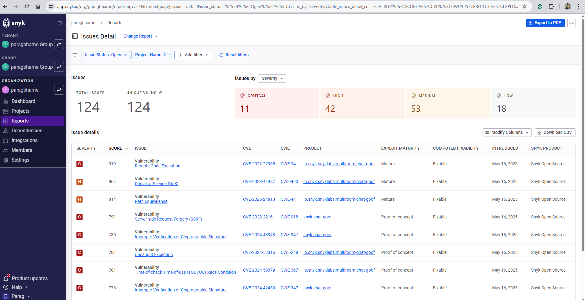
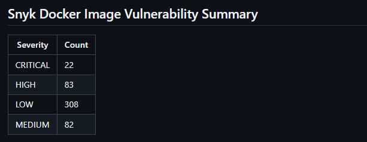

# SonarQube Scan Workflow

## Why Use SonarQube Scanning?

- **Automated Code Quality:** Ensures every code change is checked for bugs, vulnerabilities, and code smells.
- **Security (SAST):** Detects security issues early using Static Application Security Testing.
- **Continuous Integration:** Integrates with GitHub Actions to enforce quality gates before merging.
- **Actionable Feedback:** Provides developers with immediate, actionable insights.

---

## How the Workflow Works

1. **Triggers:**  
   Runs on pushes to `main`, pull requests, or manually via GitHub Actions.

2. **Steps Overview:**
   - **Checkout:** Retrieves the latest code.
   - **Setup:** Installs JDK 17 and caches dependencies for faster builds.
   - **Build & Analyze:**  
     Runs Maven to build, test, and analyze the code with SonarQube.
   - **Download SonarQube Report:**  
     Uses the SonarQube API to fetch a JSON report of detected issues.
   - **Upload Artifacts:**  
     Publishes the SonarQube issues report and JaCoCo code coverage report as downloadable artifacts.

---

## What Results Are Produced?

- **SonarQube Analysis Results:**
  - **Bugs:** Code defects that could cause failures.
  - **Vulnerabilities:** Security issues in the code.
  - **Code Smells:** Maintainability concerns.
  - **Duplications:** Repeated code blocks.
  - **Coverage:** Test coverage metrics (via JaCoCo).

- **Artifacts:**
  - `sonarqube-report.json`:  
    JSON file listing all issues found in the codebase.
  - `jacoco-report`:  
    HTML code coverage report showing which lines are covered by tests.

- **SonarQube Dashboard:**  
  Visual summary of code quality, security hotspots, and trends.








---

## Example Workflow Steps

```yaml
- name: Build and analyze
  env:
    SONAR_TOKEN: ${{ secrets.SONAR_TOKEN }}
  run: mvn -B verify org.sonarsource.scanner.maven:sonar-maven-plugin:sonar -Dsonar.projectKey=devops10x_springboot

- name: Download SonarQube issues report
  env:
    SONAR_TOKEN: ${{ secrets.SONAR_TOKEN }}
  run: |
    curl -u "${SONAR_TOKEN}:" "https://sonarcloud.io/api/issues/search?componentKeys=devops10x_springboot" -o sonarqube-report.json

- name: Upload SonarQube report artifact
  uses: actions/upload-artifact@v4
  with:
    name: sonarqube-report
    path: sonarqube-report.json

- name: Upload JaCoCo coverage report
  uses: actions/upload-artifact@v4
  with:
    name: jacoco-report
    path: target/site/jacoco/


```

### SonarQube Setup

We are using SonarCloud, the online SaaS version of SonarQube, to perform static code analysis.  
All code is analyzed in the cloud, and results are accessible through the SonarCloud dashboard.  
This eliminates the need for a local SonarQube server setup and simplifies integration with GitHub Actions.

We have configured the sonar properties in config file sonar-project.properties

---

## Summary

This workflow ensures every code change is automatically checked for quality and security, and provides downloadable reports for further review. It helps maintain high standards and reduces the risk of introducing bugs or vulnerabilities into your codebase.