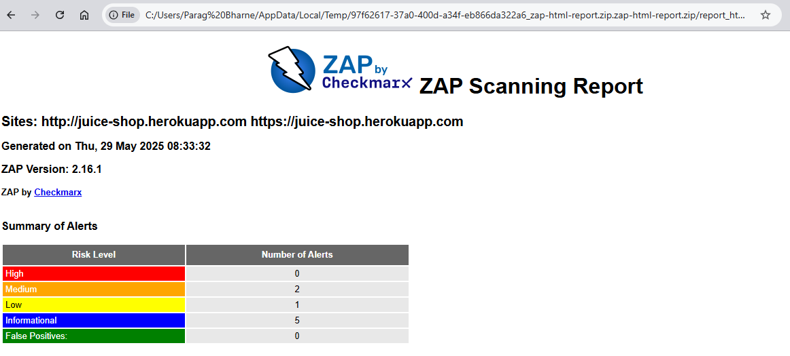
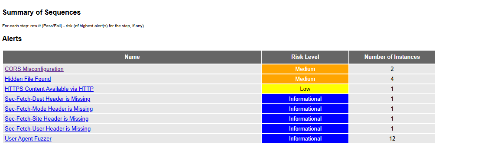
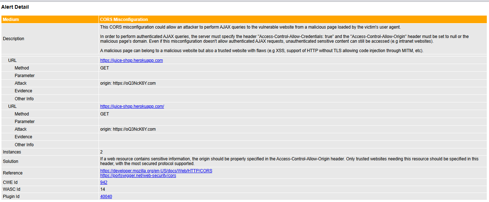
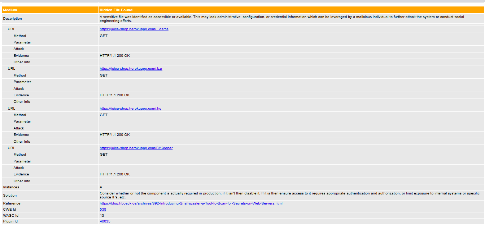

# 📘 Technical Documentation: Dynamic Application Security Testing (DAST) with OWASP ZAP in GitHub Actions

## 📌 Overview

**Dynamic Application Security Testing (DAST)** is a black-box testing method that scans running applications to identify security vulnerabilities. It simulates how an attacker might exploit exposed endpoints in real-world scenarios, focusing on HTTP-level vulnerabilities such as XSS, SQL injection, CSRF, etc.

This document explains the integration of **OWASP ZAP**, an open-source DAST tool, into our GitHub Actions CI pipeline for automated security scanning of web applications.

## ✅ Why DAST?

- Identifies vulnerabilities in the **runtime environment** (unlike SAST which scans code).
- Finds issues that only appear in **deployed or containerized environments**.
- Complements SAST, SCA, and manual testing.
- Helps catch issues before they reach production, reducing risk and remediation costs.

## 🛠️ Why OWASP ZAP?

- Open-source, actively maintained, backed by OWASP.
- Supports automation via CLI and GitHub Actions.
- Provides detailed reports (HTML, XML).
- Supports rules configuration for **baseline**, **full**, and **API scans**.
- Extensible via add-ons and scripts.

## 🚀 How It Works (CI/CD Pipeline Integration)

**GitHub Action Trigger**:  
The DAST scan runs on:
- Manual trigger (`workflow_dispatch`)
- Push events to `main`, `master`, `image`, and `dast` branches
- On pull requests for continuous integration

## ⚙️ GitHub Actions Configuration

\`\`\`yaml
name: DAST with Zap

on:
  workflow_dispatch:
  push:
    branches: [main, master, image, dast]
  pull_request:
    types: [opened, synchronize, reopened]

jobs:
  build:
    runs-on: ubuntu-latest
    name: OWASP ZAP Full Scan

    permissions:
      contents: read
      packages: write
      id-token: write
      issues: write

    steps:
    - name: Checkout
      uses: actions/checkout@v4
      with:
        ref: dast

    - name: ZAP Scan
      id: zap_scan
      uses: zaproxy/action-full-scan@v0.12.0
      with:
        token: \${{ secrets.GITHUB_TOKEN }}
        docker_name: 'ghcr.io/zaproxy/zaproxy:stable'
        target: 'https://juice-shop.herokuapp.com'
        rules_file_name: '.zap/rules.tsv'
        cmd_options: '-a'

    - name: Upload ZAP HTML Report
      uses: actions/upload-artifact@v4
      with:
        name: zap-html-report
        path: report_html.html

    - name: Show ZAP Summary in GitHub Actions
      if: always()
      run: |
        echo "## 🔍 ZAP Scan Summary" >> $GITHUB_STEP_SUMMARY
        echo "- Target: https://juice-shop.herokuapp.com" >> $GITHUB_STEP_SUMMARY
        echo "- Scan Type: Full Scan" >> $GITHUB_STEP_SUMMARY
        echo "- [Download HTML Report](./zap-html-report/report_html.html)" >> $GITHUB_STEP_SUMMARY
\`\`\`

## 📤 Output Artifacts

- `report_html.html`: The full vulnerability scan report in a browser-viewable format.
- The summary includes:
  - Target URL
  - Scan type
  - Direct download link to the report

## 🧠 Key Features

- **Rule Customization**: Use `.zap/rules.tsv` to enforce or ignore specific vulnerabilities.
- **Fail-Safe Execution**: The `Show ZAP Summary` step runs even if the scan fails.
- **Security Gate Potential**: This pipeline can be extended to break builds if certain thresholds (e.g., High severity > 0) are exceeded.

## 📉 Limitations

- ZAP full scans can take several minutes depending on the size and complexity of the target.
- Not suitable for scanning applications requiring complex authentication flows without custom setup.
- Dynamic scans may miss vulnerabilities that don’t manifest during execution.

## 📈 Improvements & Extensions

- Add **XML report generation** and parse it for severity counts.
- Integrate **issue creation** in GitHub if high/critical findings are detected.
- Schedule regular scans using a `cron` trigger.
- Use **ZAP Baseline** for faster scans in PRs, and **Full Scan** on deploy branches.

## ✅ Best Practices

- Run ZAP on staging or dedicated test environments.
- Limit scan scope or split scans to reduce execution time.
- Keep `.zap/rules.tsv` updated to reflect current risk tolerance.
- Review scan reports regularly and track metrics over time.
