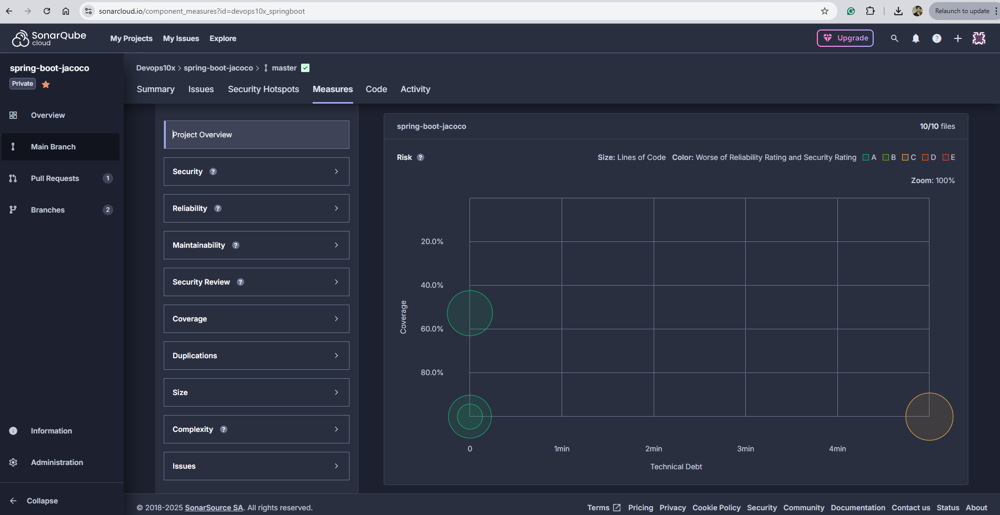
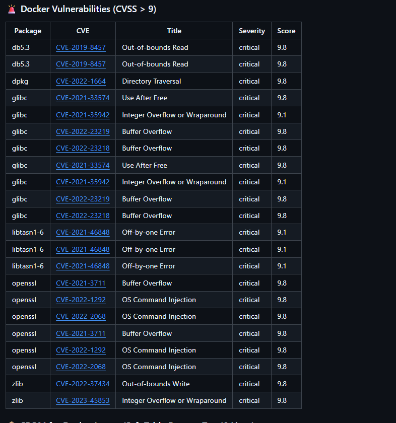

# 🛡️ Docker Image Scanning – What, Why, and How

## 🧠 What is Docker Image Scanning?

Docker image scanning is the process of analyzing container images to detect known vulnerabilities in the software packages, dependencies, and layers that make up the image. These vulnerabilities are typically referenced against public vulnerability databases like CVE (Common Vulnerabilities and Exposures).

Tools like **Snyk** specialize in **Software Composition Analysis (SCA)** by examining open-source components in container images to ensure they are free from critical or high-risk security issues.

---

## ❓ Why Perform Image Scanning?

1. **Security Risk Mitigation**
   Containers often include third-party libraries and OS packages that may contain vulnerabilities. Scanning helps catch those early before they reach production.

2. **Compliance and Auditing**
   Many industries require strict adherence to standards (e.g., ISO, SOC2, HIPAA). Image scanning ensures you're staying compliant with software security practices.

3. **Shift-Left Security**
   Integrating security checks early in the CI/CD pipeline (i.e., during build time) avoids costly fixes later in production.

4. **Continuous Monitoring**
   Even if an image was safe yesterday, a new CVE might be discovered today. Scanning ensures your base images stay secure over time.

5. **Visibility Through SBOM**
   Tools like Snyk and Syft can generate a **Software Bill of Materials (SBOM)**, which gives a transparent view of all packages and dependencies in your image, aiding in incident response and compliance.

---

## 🛠️ What Needs to be Done?

To incorporate secure practices in your container workflow:

* ✅ **Generate SBOMs** for all container images and source code using GitHub Actions and tools like `syft`.
* ✅ **Scan Docker images** for vulnerabilities using tools like **Snyk**, ideally integrated into your CI/CD pipelines (e.g., GitHub Actions).
* ✅ **Filter vulnerability reports** to prioritize actionable issues (e.g., high and critical severities).
* ✅ **Fail builds or create GitHub Issues** automatically for vulnerable images.
* ✅ **Continuously monitor** registries for new vulnerabilities in existing images.

---

## 🧪 GitHub Actions for Image Scanning with Snyk and SBOM

Here is a sample GitHub Actions workflow that demonstrates generating SBOM using Syft and scanning the Docker image with Snyk:

```yaml
name: Scan Docker Image with Snyk and Generate SBOM

on:
  workflow_dispatch:
  push:
    branches: ["main"]

permissions:
  contents: read
  security-events: write

jobs:
  docker-image-scanning:
    runs-on: ubuntu-latest
    steps:
      - name: Checkout Code
        uses: actions/checkout@v4

      - name: Log in to Docker Hub (Optional)
        run: echo "Logging in to Docker Hub..."
        env:
          DOCKER_USERNAME: ${{ secrets.DOCKER_USERNAME }}
          DOCKER_PASSWORD: ${{ secrets.DOCKER_PASSWORD }}

      - name: Build Docker Image
        run: docker build -t my-image-name:latest .

      - name: Generate SBOM using Syft
        uses: anchore/sbom-action@v0.15.1
        with:
          image: "my-image-name:latest"
          format: "spdx-json"
          output-file: "sbom.spdx.json"

      - name: Upload SBOM to GitHub Security tab
        uses: github/codeql-action/upload-sarif@v3
        with:
          sarif_file: sbom.spdx.json

      - name: Run Snyk to scan Docker image
        uses: snyk/actions/docker@master
        env:
          SNYK_TOKEN: ${{ secrets.SNYK_TOKEN }}
        with:
          image: my-image-name:latest
          args: --file=Dockerfile --severity-threshold=medium --json-file-output=snyk-vuln-report.json

      - name: Upload vulnerability report to GitHub Security tab
        uses: github/codeql-action/upload-sarif@v3
        with:
          sarif_file: snyk-vuln-report.json
```

## 🔧 Prerequisites

Ensure the following secrets are added to your GitHub repository:

- `SNYK_TOKEN`: Your Snyk API token (get it from [Snyk account settings](https://app.snyk.io/account)).

Install Docker on the GitHub runner (`ubuntu-latest` includes it by default).

---

## 🧱 Step-by-Step Workflow Overview

### 1. **Build Docker Image**

```yaml
- name: Build Docker image
  run: docker build -t my-image:latest .
```

> 💡 Replace `my-image:latest` with your preferred image name/tag if needed.

---

### 2. **Scan Docker Image for Vulnerabilities using Snyk**

```yaml
- name: Snyk scan Docker image (JSON output)
  continue-on-error: true
  env:
    SNYK_TOKEN: ${{ secrets.SNYK_TOKEN }}
  run: snyk container test my-image:latest --file=Dockerfile --json > snyk-docker.json
```

- `--file=Dockerfile`: Ensures Snyk uses your Dockerfile context.
- `--json`: Produces machine-readable output for automation or reporting.
- `continue-on-error: true`: Avoids failing the workflow due to discovered vulnerabilities (can be removed for stricter gating).

---

### 3. **Upload Snyk Docker Report to GitHub Artifacts**

```yaml
- name: Upload Snyk Docker JSON report
  uses: actions/upload-artifact@v4
  with:
    name: snyk-docker-report
    path: snyk-docker.json
```

> 📁 The uploaded `snyk-docker-report` artifact is downloadable from the GitHub Actions UI.

---

### 4. **Monitor the Project on Snyk Dashboard (Optional)**

```yaml
- name: Monitor Snyk project (upload to Snyk portal)
  env:
    SNYK_TOKEN: ${{ secrets.SNYK_TOKEN }}
  run: snyk monitor --all-projects
```

This step sends project data to your Snyk dashboard for historical tracking, trends, and alerts.

---

## 📄 Example Vulnerability Summary Output (Optional)

```yaml
- name: Post Unique Issues by Severity with Total and HTML Report Link
  run: |
    critical=$(jq '[.[] | .vulnerabilities[]? | select(.severity=="critical") | .id] | unique | length' snyk-docker.json)
    high=$(jq '[.[] | .vulnerabilities[]? | select(.severity=="high") | .id] | unique | length' snyk-docker.json)
    medium=$(jq '[.[] | .vulnerabilities[]? | select(.severity=="medium") | .id] | unique | length' snyk-docker.json)
    low=$(jq '[.[] | .vulnerabilities[]? | select(.severity=="low") | .id] | unique | length' snyk-docker.json)

    total=$((critical + high + medium + low))

    echo "## 🐳 Snyk Docker Image Vulnerability Summary" >> $GITHUB_STEP_SUMMARY
    echo "" >> $GITHUB_STEP_SUMMARY
    echo "| Severity  | Unique Count |" >> $GITHUB_STEP_SUMMARY
    echo "|-----------|---------------|" >> $GITHUB_STEP_SUMMARY
    echo "| Critical  | $critical |" >> $GITHUB_STEP_SUMMARY
    echo "| High      | $high |" >> $GITHUB_STEP_SUMMARY
    echo "| Medium    | $medium |" >> $GITHUB_STEP_SUMMARY
    echo "| Low       | $low |" >> $GITHUB_STEP_SUMMARY
    echo "| **Total** | **$total** |" >> $GITHUB_STEP_SUMMARY
```





---

## 📦 Optional: Convert to HTML Report

```yaml
- name: Install snyk-to-html
  run: npm install -g snyk-to-html

- name: Convert Snyk JSON to HTML
  run: snyk-to-html -i snyk-docker.json -o snyk-docker-report.html

- name: Upload Snyk Docker HTML Report
  uses: actions/upload-artifact@v4
  with:
    name: snyk-docker-html-report
    path: snyk-docker-report.html
```
## 🧾 What is an SBOM?

A **Software Bill of Materials (SBOM)** is a structured list of all software components, libraries, and dependencies included in a container or application.

We generate SBOMs using [Syft](https://github.com/anchore/syft) in GitHub Actions as part of our automated CI/CD pipeline. This provides full visibility of the components inside our Docker images and local file systems.

---

## ⚙️ How We Do It: GitHub Actions + Syft + Snyk

We use GitHub Actions to automate:

1. ✅ SBOM generation using **Syft**.
2. 🛡️ Vulnerability scanning using **Snyk**.
3. 📂 Artifact uploading for audit and tracking.

---

### ✅ Step 1: SBOM Generation with Syft

We generate SBOMs for both the **Docker image** and the **file system** using Syft.

```yaml
- name: Generate SBOM for Docker image using Syft
  uses: anchore/sbom-action@v0.15.0
  with:
    image: ${{ env.IMAGE_NAME }}:${{ env.IMAGE_TAG }}
    format: spdx-json
    output-file: sbom-image.spdx.json

- name: Generate SBOM for File System using Syft
  run: |
    syft dir:. -o spdx-json > sbom-filesystem.spdx.json

---
✅ Benefits of This Workflow
⏱️ Automated Security: Integrated into CI/CD, no manual steps needed.

🔍 Traceability: Artifacts stored and linked to build runs.

📊 Visibility: Clear insights into what’s inside your containers and their risks.

---

## ✅ Summary

| Task                       | Tool          | Output                            |
|----------------------------|---------------|-----------------------------------|
| Build Docker image         | Docker        | `my-image:latest`                 |
| Scan for vulnerabilities   | Snyk CLI      | `snyk-docker.json`                |
| Upload reports             | GitHub Action | Artifacts (`.json` & `.html`)     |
| Monitor on Snyk Dashboard  | Snyk CLI      | Snyk Project (visible on portal)  |
| Optional summaries         | `jq`          | GitHub Actions summary section    |
